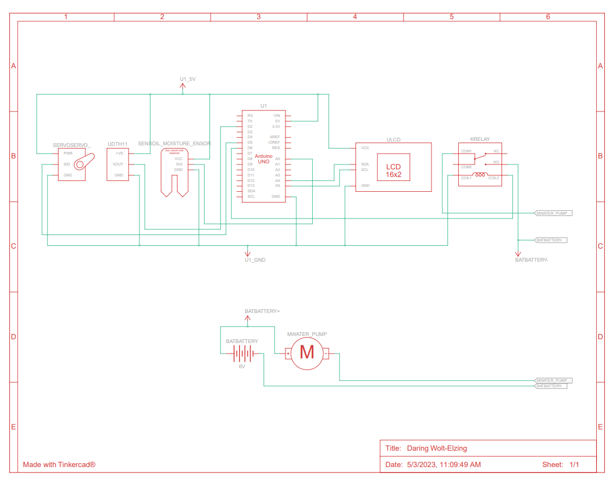
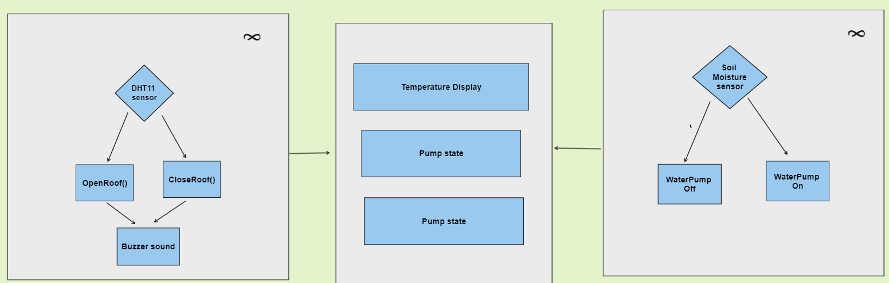

# Smart_Garden_ArduinoUno: Autonomous Seedling Management using Arduino Uno

## Project Description

The Smart Garden is an automated environmental control system designed using the Arduino Uno. Its primary mission is to safeguard high-sensitivity seedlings by maintaining a stable micro-climate, reducing human effort, and protecting plants from unfavorable weather conditions.

By integrating real-time sensory data with mechanical actuators, the system automates two critical gardening tasks:

- Precision Irrigation: Uses soil moisture sensing to trigger a DC water pump only when the substrate is dry, preventing both dehydration and root rot.
- Climate Shielding: Employs a DHT11 sensor to monitor ambient temperature. If heat levels exceed the seedling's safety threshold, a servo-controlled shade is deployed to prevent wilting.

The system provides transparency through a live LCD dashboard and an audible buzzer that signals whenever the protective shade adjusts its position.


The objective of this project is to automate tending to plants, especially seedlings. Seedings are affected by unfavourable weather conditions. To safeguard a seedling's growth and to save human effort smart garden could be used. 

## System Architecture 
System circuit schematics: 
       
Software flowchart: 


## 🛠️ Implementation Details
1. Irrigation & Soil Moisture Logic

The system monitors hydration using two distinct methods from the soil moisture sensor:
- Analog Mapping: Raw values (0−1023) are mapped to a 0−100% scale for user-friendly monitoring.
- Digital Threshold: Uses a pre-set threshold on the sensor to trigger the pump. A value of 0 (LOW) indicates moist soil, while 1 (HIGH) indicates dry soil.

```cpp
// Read analog value and map to percentage
int moistureValue = analogRead(SoilMoisturePIN);
int moisturePercent = map(moistureValue, 0, 1023, 0, 100); 

// Digital trigger for pump control
int moistureThreshold = digitalRead(SoilMoistureThresholdPIN); 

if (moistureThreshold == LOW) {   
    lcd.print("OFF");
    digitalWrite(waterPump, LOW);  // Soil is moist; pump off
} else {
    lcd.print("ON ");
    digitalWrite(waterPump, HIGH); // Soil is dry; pump on
}
```

2. Temperature & Shade Control

The DHT11 sensor tracks the ambient air temperature. To protect seedlings from heat stress:

- Mechanism: Two servo motors control the shade.
- Operation: The shade remains open when the servo blades are at 180∘. If the temperature exceeds the optimal limit, the servos rotate to 0∘, allowing gravity to pull the protective shade down.
- Feedback: An LCD displays the live temperature and pump state, while a buzzer sounds during any shade transition. 

## Components Used
- Microcontroller: Arduino Uno
- Sensors: DHT11 sensor (temperature/humidity), Analog Soil Moisture Probe
- Control: 1-channel 5v Relay Module
- Output: 16x2 LCD display
- Power:  4 x 1.5 V DC batteries


## Contributors
Meron Yakob

Noah Yohannes


